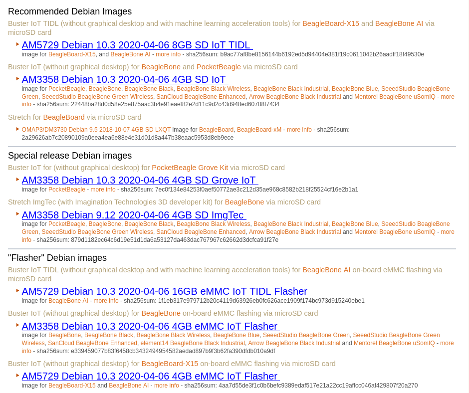
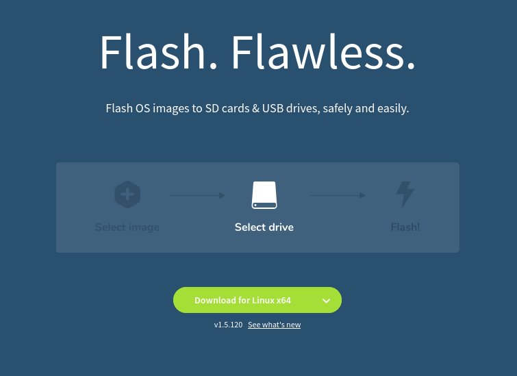
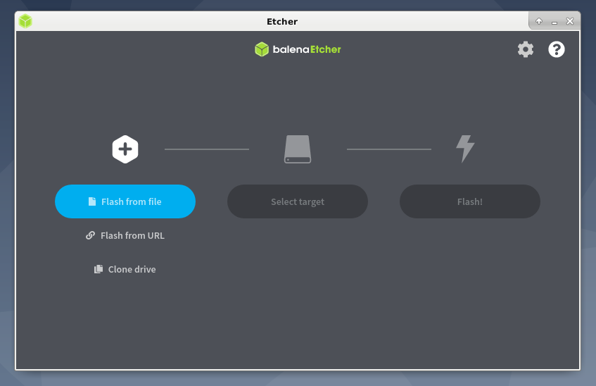
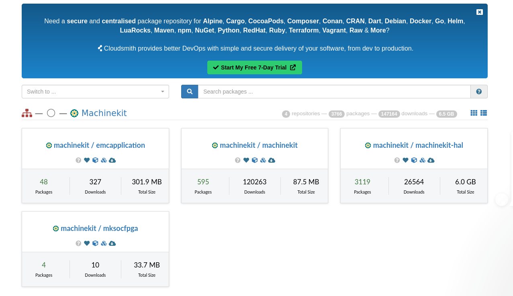

summary: MachineKit Getting-Started
id: Getting Started
categories: Trying Docs. with .md files from asciidocs...
tags: medium
status: Published
authors: Seth

## Testing the Getting-Started ASCIIDOC into .md format...
Duration: 4

This is a small set up of a .md file to show how to set up your install on
a BBB (BeagleBone Black)...

## Setting up machinekit on a platform or a BBB for instance...
Duration: 4

This document is intended to get Machinekit installed on the platform of your
choice. Because of the multi-platform nature of the machinekit project, there
can be some differences in the installation for a specific platform.

## [NOTE]
Duration: 4

You should first have a working Debian installation (https://www.debian.org/).

Details on how to set up Debian Buster armhf on a PC, add a rt-preempt kernel and machinekit packages.

As a general example of a package install, you may find it useful to read on!

## Installing Debian Buster on armhf with Etcher!
Duration: 15

Go to beagleboard.org/latest-images and grab a local copy of a Debian Buster image.

...

Then, go here to install Etcher: https://www.balena.io/etcher/ .

Use Etcher and your SD Card to burn the image on your development desktop from say this image

    https://debian.beagleboard.org/images/bone-debian-10.3-iot-armhf-2020-04-06-4gb.img.xz

## Installation options
Duration: 4

https://cloudsmith.io/~machinekit/repos

## Installing packages for armhf board or another architecture...
Duration: 4

curl -1sLf \
  'https://dl.cloudsmith.io/public/machinekit/machinekit/setup.deb.sh' \
  | sudo -E bash

curl -1sLf \
  'https://dl.cloudsmith.io/public/machinekit/machinekit-hal/setup.deb.sh' \
  | sudo -E bash

curl -1sLf \
  'https://dl.cloudsmith.io/public/machinekit/emcapplication/setup.deb.sh' \
  | sudo -E bash

## Development packages
Duration: 4

In addition to the configuring of the Cloudsmith repository, installation of the
kernel, there are some additional steps to take to install a development
setup.

sudo apt update

sudo apt install machinekit-hal=0.4.20868-1.gitc2e248500~buster

sudo apt install emcapplication=0.4.20868-1.gitc2e248500~buster

## Once configured, please visit:
Duration: 4

http://www.machinekit.io/docs/

and...

https://www.machinekit.io/docs/index-user/ for first time 
installation prerequisites.
